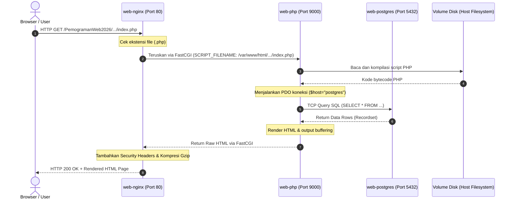

# 🧠 Docker Architecture & Engineering Deep-Dive
> **Dokumen Panduan Konsep & Mekanisme Internal Docker Stack (PHP 8.3, NGINX 1.26, PostgreSQL 17, Adminer)**

Dokumen ini menjelaskan secara fundamental arsitektur, siklus hidup request (*request lifecycle*), dan fungsi setiap baris konfigurasi yang telah kita bangun, membandingkannya langsung dengan cara kerja Laragon.

---

## 📑 Daftar Isi
1. [Mental Model: Laragon vs Docker](#1-mental-model-laragon-vs-docker)
2. [Arsitektur 4 Service & Pembagian Perannya](#2-arsitektur-4-service--pembagian-perannya)
3. [Siklus Hidup Request (Request Lifecycle Step-by-Step)](#3-siklus-hidup-request-request-lifecycle-step-by-step)
4. [Bedah Berkas Konfigurasi (Line-by-Line Breakdown)](#4-bedah-berkas-konfigurasi-line-by-line-breakdown)
   - [A. docker-compose.yml](#a-docker-composeyml)
   - [B. docker/php/Dockerfile](#b-dockerphpdockerfile)
   - [C. docker/nginx/default.conf](#c-dockernginxdefaultconf)
   - [D. docker/php/conf.d/*.ini](#d-dockerphpconfdini)
5. [Mekanisme Jaringan (Networking) & DNS Internal Docker](#5-mekanisme-jaringan-networking--dns-internal-docker)
6. [Mekanisme Volume & Permission I/O di macOS/OrbStack](#6-mekanisme-volume--permission-io-di-macosorbstack)
7. [Mental Model Troubleshooting](#7-mental-model-troubleshooting)

---

## 1. Mental Model: Laragon vs Docker

| Aspek | Laragon (Monolitik di Host OS) | Docker (Micro-Services Terisolasi) |
|---|---|---|
| **Lingkungan Eksekusi** | Semua proses (Nginx, PHP, Postgres) berjalan langsung di OS host (Windows) sebagai process biasa. | Setiap komponen berjalan di **container Linux terpisah** menggunakan isolasi Kernel (Namespaces & Cgroups). |
| **Pencemaran Host OS** | Menginstal runtime & library langsung di OS. Sulit berganti versi PHP/Postgres tanpa konflik. | **Zero Clutter**. Host OS (macOS) tetap bersih. Menghapus folder/container = menghapus seluruh dependency tanpa sisa. |
| **Komunikasi Antar Service** | Semuanya berbagi `localhost` yang sama karena berada di satu network interface host. | Setiap container punya IP dan interface jaringan sendiri. Komunikasi internal menggunakan **Service Name** via DNS internal Docker. |
| **Reproducibility** | Rentan issue *"it works on my machine"* karena bergantung pada konfigurasi OS lokal. | **100% Identik** di Mac, Linux, Windows, maupun server production (CI/CD / Cloud). |

---

## 2. Arsitektur 4 Service & Pembagian Perannya

```
                ┌─────────────────────────────────────────────────────────┐
                │                       HOST (macOS)                      │
                │     Browser (http://localhost:80 & :8080) / IDE         │
                └───────────────────────────┬─────────────────────────────┘
                                            │ Port Forwarding (:80, :8080, :5432)
                                            ▼
┌────────────────────────────────────── web-net (Bridge Network) ──────────────────────────────────────┐
│                                                                                                      │
│   ┌───────────────────────────┐    FastCGI (Port 9000)     ┌─────────────────────────────────────┐   │
│   │         web-nginx         │ ─────────────────────────► │               web-php               │   │
│   │      (nginx:1.26-alpine)  │                            │     (php:8.3-fpm-alpine + ext)      │   │
│   │                           │ ◄───────────────────────── │                                     │   │
│   │  • Terima HTTP Request    │      HTML / JSON Response  │  • Eksekusi Script PHP              │   │
│   │  • Serve file statis      │                            │  • Composer CLI runtime             │   │
│   │  • Buffer & Security Hdr  │                            │  • Driver pdo_pgsql & pdo_mysql     │   │
│   └───────────────────────────┘                            └──────────────────┬──────────────────┘   │
│                                                                               │                      │
│                                                                               │ TCP Query (:5432)    │
│   ┌───────────────────────────┐                            ┌──────────────────▼──────────────────┐   │
│   │        web-adminer        │ ◄───────────────────────── │            web-postgres             │   │
│   │       (adminer:4.8.1)     │        TCP Query (:5432)   │         (postgres:17-alpine)        │   │
│   │                           │                            │                                     │   │
│   │  • Web GUI Database       │                            │  • Database Engine Relasional       │   │
│   │  • Port 8080              │                            │  • Persistent Data (postgres_data)  │   │
│   └───────────────────────────┘                            └─────────────────────────────────────┘   │
│                                                                                                      │
└──────────────────────────────────────────────────────────────────────────────────────────────────────┘
```

1. **`web-nginx` (Web Server & Reverse Proxy):**
   - Menghadap langsung ke publik/browser di port `80`.
   - Menangani berkas statis (HTML, CSS, JS, Gambar) secara instan tanpa membebani PHP.
   - Meneruskan (*proxy*) permintaan berkas `.php` ke PHP-FPM menggunakan protokol **FastCGI**.
2. **`web-php` (PHP-FPM Application Engine):**
   - **PHP-FPM** (*FastCGI Process Manager*) tidak bisa menerima request HTTP langsung dari browser. Ia adalah daemon background yang menerima protokol FastCGI di port `9000`.
   - Mengompilasi dan mengeksekusi kode PHP, berinteraksi dengan database via `pdo_pgsql`, lalu mengembalikan output HTML murni ke NGINX.
3. **`web-postgres` (Relational Database Server):**
   - Menyimpan seluruh data tabel, relasi, dan indeks secara aman di dalam *named volume* Docker (`postgres_data`).
   - Terbuka ke jaringan container di port `5432` dan dipetakan ke host agar Anda bisa mengaksesnya via DBeaver/DataGrip/CLI.
4. **`web-adminer` (Database Management GUI):**
   - Web interface satu halaman yang sangat ringan (alternatif modern untuk phpMyAdmin / pgAdmin) di port `8080`.

---

## 3. Siklus Hidup Request (Request Lifecycle Step-by-Step)

Ketika Anda membuka URL `http://localhost/PemogramanWeb2026/kode-praktikum/jobsheet-08/index.php`:



---

## 4. Bedah Berkas Konfigurasi (Line-by-Line Breakdown)

### A. `docker-compose.yml`

```yaml
services:
  php:
    build:
      context: .                          # Direktori root sebagai konteks build
      dockerfile: docker/php/Dockerfile   # Berkas instruksi pembuatan image PHP
      args:
        UID: ${UID:-1000}                 # Oper User ID host agar file permission cocok
        GID: ${GID:-1000}                 # Oper Group ID host
    container_name: web-php               # Nama spesifik container di sistem Docker
    restart: unless-stopped               # Otomatis restart jika crash/reboot kecuali dimatikan manual
    volumes:
      - ./:/var/www/html                  # Mount source code dari host ke dalam container
    environment:                          # Inject variabel lingkungan ke dalam PHP
      DB_HOST: postgres                   # Host DB adalah nama service postgres (bukan localhost!)
      DB_PORT: ${DB_PORT:-5432}
      DB_DATABASE: ${DB_DATABASE:-app_db}
      DB_USERNAME: ${DB_USERNAME:-postgres}
      DB_PASSWORD: ${DB_PASSWORD:-postgres}
    depends_on:
      postgres:
        condition: service_healthy        # Tunggu PostgreSQL SEHAT (siap terima query) baru nyalakan PHP

  nginx:
    image: nginx:1.26-alpine              # Menggunakan image Nginx 1.26 Stable resmi
    container_name: web-nginx
    ports:
      - "${HTTP_PORT:-80}:80"             # Port Binding: [Port di Mac]:[Port di Container]
    volumes:
      - ./:/var/www/html:ro               # Read-Only mount source code untuk web server
      - ./docker/nginx/default.conf:/etc/nginx/conf.d/default.conf:ro # Timpa config default Nginx
    depends_on:
      - php

  postgres:
    image: postgres:17-alpine             # PostgreSQL 17 (Dukungan 5 tahun s.d 2029)
    container_name: web-postgres
    ports:
      - "${DB_PORT:-5432}:5432"
    environment:
      POSTGRES_DB: ${DB_DATABASE:-app_db}
      POSTGRES_USER: ${DB_USERNAME:-postgres}
      POSTGRES_PASSWORD: ${DB_PASSWORD:-postgres}
    volumes:
      - postgres_data:/var/lib/postgresql/data # Volume terisolasi agar data tidak hilang saat container dihapus
    healthcheck:                          # Script otomatis mengecek kesiapan database engine
      test: ["CMD-SHELL", "pg_isready -U postgres -d app_db"]
      interval: 5s                        # Jalankan tes tiap 5 detik
      timeout: 5s
      retries: 5
      start_period: 10s                   # Waktu toleransi inisialisasi awal database
```

---

### B. `docker/php/Dockerfile`

Image bawaan `php:8.3-fpm-alpine` sangat minimalis (belum punya ekstensi database maupun Composer). `Dockerfile` adalah resep dapur untuk meraciknya:

```dockerfile
FROM php:8.3-fpm-alpine                   # Base image resmi PHP 8.3 berbasis Linux Alpine (sangat ringan ~30MB)

ARG UID=1000
ARG GID=1000

# 1. Install header file C & library pendukung yang dibutuhkan ekstensi PHP
RUN apk update && apk add --no-cache \
    libpq-dev \                           # Header C untuk PostgreSQL driver
    libzip-dev \                          # Header C untuk ZIP
    libpng-dev libjpeg-turbo-dev freetype-dev \ # Header C untuk pemrosesan gambar (GD)
    icu-dev \                             # Header C untuk Internationalization (Intl)
    oniguruma-dev \                       # Header C untuk Regex multibyte
    postgresql-client mariadb-client \    # CLI tool psql dan mysql untuk keperluan shell
    git curl unzip zip shadow             # Utility sistem (shadow untuk groupmod/usermod)

# 2. Kompilasi ekstensi PHP secara native menggunakan thread CPU paralel (-j$(nproc))
RUN docker-php-ext-configure gd --with-freetype --with-jpeg \
    && docker-php-ext-install -j$(nproc) \
        pdo pdo_pgsql pgsql \             # Driver PostgreSQL
        pdo_mysql mysqli \                # Driver MySQL/MariaDB
        gd intl zip bcmath exif opcache   # Utility, math, EXIF, dan cache

# 3. Multi-Stage Copy: Mengambil binary Composer resmi tanpa perlu install manual
COPY --from=composer:2 /usr/bin/composer /usr/bin/composer

# 4. Salin konfigurasi PHP kustom kita ke direktori auto-load PHP
COPY docker/php/conf.d/custom.ini /usr/local/etc/php/conf.d/99-custom.ini
COPY docker/php/conf.d/opcache.ini /usr/local/etc/php/conf.d/99-opcache.ini

# 5. Samakan ID user www-data dengan user macOS agar permission berkas tidak bentrok
RUN usermod -u ${UID} www-data && groupmod -g ${GID} www-data

WORKDIR /var/www/html                     # Direktori kerja default di dalam container
USER www-data                             # Jalankan PHP-FPM sebagai non-root demi keamanan standar industri
```

---

### C. `docker/nginx/default.conf`

```nginx
server {
    listen 80;
    server_name localhost;
    root /var/www/html;                   # Root folder tempat file berada
    index index.php index.html;

    client_max_body_size 64M;             # Izinkan upload form hingga 64MB
    server_tokens off;                    # Sembunyikan versi Nginx demi keamanan (Security Best Practice)

    # Security Headers standar industri
    add_header X-Frame-Options "SAMEORIGIN" always;
    add_header X-XSS-Protection "1; mode=block" always;
    add_header X-Content-Type-Options "nosniff" always;

    autoindex on;                         # Aktifkan daftar direktori jika tidak ada index.php

    # Universal Router: Coba cari file fisik ($uri), lalu folder ($uri/), 
    # jika tidak ada oper ke index.php (Pola router Laravel/Symfony)
    location / {
        try_files $uri $uri/ /index.php?$query_string;
    }

    # Blok eksekusi berkas PHP
    location ~ \.php$ {
        try_files $uri =404;
        fastcgi_split_path_info ^(.+\.php)(/.+)$;
        fastcgi_pass php:9000;            # Kirim request ke container `web-php` di port 9000
        fastcgi_index index.php;
        include fastcgi_params;
        fastcgi_param SCRIPT_FILENAME $document_root$fastcgi_script_name;
        fastcgi_param PATH_INFO $fastcgi_path_info;

        # FastCGI Buffer Tuning: Mencegah error '502 Bad Gateway' saat header/payload response besar
        fastcgi_buffer_size 128k;
        fastcgi_buffers 4 256k;
        fastcgi_busy_buffers_size 256k;
        fastcgi_read_timeout 300;
    }

    # Blokir akses publik ke file tersembunyi seperti .env atau .git
    location ~ /\.(?!well-known).* {
        deny all;
    }
}
```

---

## 5. Mekanisme Jaringan (Networking) & DNS Internal Docker

Inilah perbedaan paling fundamental yang sering membingungkan pemula saat beralih dari Laragon ke Docker:

### A. Mengapa `$host = "localhost"` Gagal di Docker?
* Di Laragon, PHP dan Postgres tinggal di satu komputer yang sama.
* Di Docker, container `web-php` dan `web-postgres` adalah **dua mesin Linux virtual terpisah**.
* Jika script PHP mencoba koneksi ke `localhost:5432`, PHP mencari PostgreSQL **di dalam container PHP itu sendiri** (yang jelas tidak ada database server di dalamnya).

### B. Bagaimana Docker Menyelesaikannya? (Embedded DNS Resolver)
* Docker Compose otomatis membuat sebuah bridge network bernama `web-net`.
* Docker menyematkan DNS server internal pada alamat IP `127.0.0.11`.
* Setiap kali PHP memanggil nama host `postgres`, DNS internal Docker otomatis menerjemahkannya (*resolve*) ke alamat IP private milik container `web-postgres`.

```text
Script PHP: "Tolong hubungkan ke host 'postgres'"
     │
     ▼
DNS Docker (127.0.0.11): "'postgres' beralamat di 172.20.0.3"
     │
     ▼
PHP terhubung sukses ke Database di 172.20.0.3:5432!
```

---

## 6. Mekanisme Volume & Permission I/O di macOS/OrbStack

### 1. Bind Mount (`./:/var/www/html`)
* Folder project di Mac Anda dihubungkan secara real-time dua arah (*two-way sync*) ke `/var/www/html` di dalam container.
* Saat Anda mengedit berkas di VS Code Mac, Linux di dalam container langsung membaca perubahan tersebut tanpa proses *upload* atau *copy*.

### 2. User Permission Mapping (`UID=1000` / `USER www-data`)
* Di Linux, user `root` (UID 0) memiliki hak mutlak. Jika PHP berjalan sebagai root dan membuat file (misal log atau file upload), file tersebut di Mac Anda akan terkunci (*locked by root*) dan tidak bisa diedit/dihapus secara normal.
* Dengan memetakan user ke `www-data` (UID 1000), file yang dibuat oleh container memiliki permission yang sama dengan user Mac Anda.

---

## 7. Mental Model Troubleshooting

Jika di kemudian hari terjadi kendala, gunakan alur diagnosis berikut:

```text
Masalah: Halaman Blank / Error 502 Bad Gateway
  └─ Cek log Nginx: `docker compose logs nginx`
  └─ Cek status PHP: `docker compose logs php`

Masalah: "Connection Refused" pada Database
  └─ Pastikan host database di script PHP adalah `postgres`, bukan `localhost`.
  └─ Cek status kesehatan Postgres: `docker compose ps` (Pastikan statusnya "healthy").
  └─ Cek log PostgreSQL: `docker compose logs postgres`

Masalah: Perubahan Ekstensi / Dockerfile tidak berefek
  └─ Container harus di-rebuild: `docker compose up -d --build`
```
